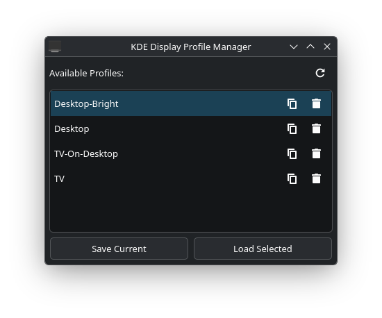

# What is KDE Display Profiles?

A GUI to save and load display profile configurations on Plasma KDE on Wayland using kscreen-doctor.

I personally copy the load profile command via the GUI and use it to make a global shortcut to load my display profiles.

